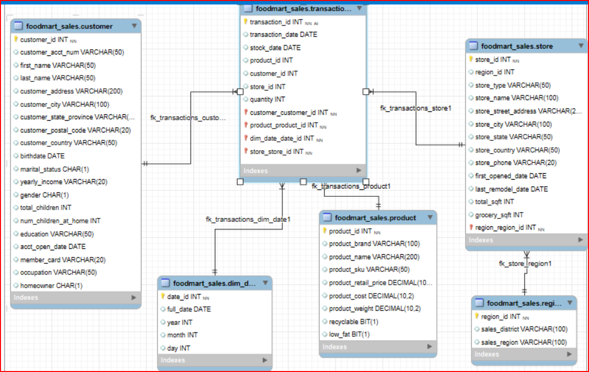
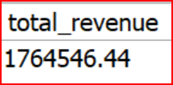
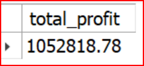
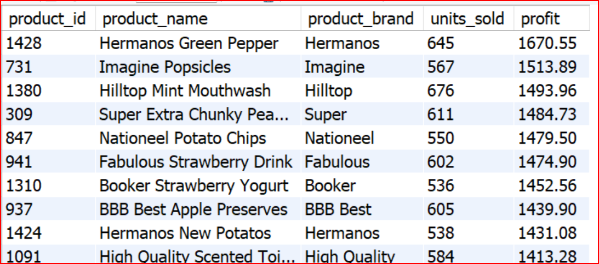
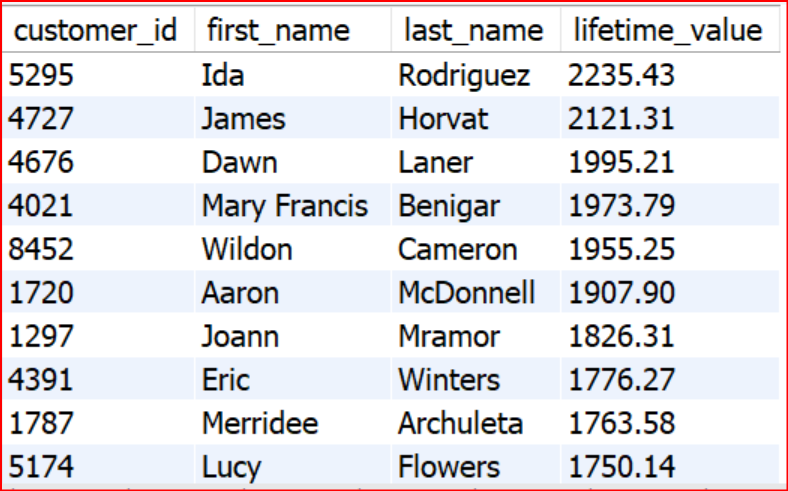
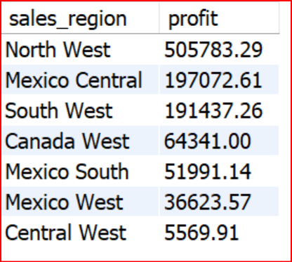
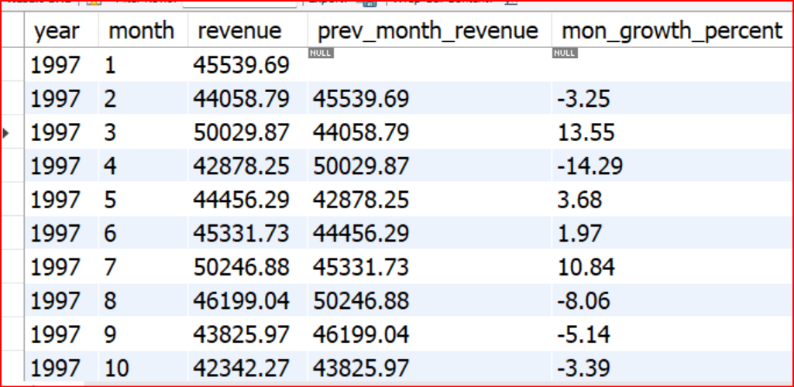

# FoodMart Sales Analytics Project

## Project Overview

This project is an end-to-end SQL analytics solution built using the FoodMart Sales dataset.  
The project focuses on transforming raw retail transaction data into actionable business insights through data cleaning, ETL pipelines, dimensional modeling, KPI reporting, and advanced analytical queries.

The solution simulates a real-world retail analytics environment commonly used in Business Intelligence and Data Analytics roles.

---

# Business Objective

The goal of this project is to analyze retail sales performance and provide insights related to:

- Revenue and profitability
- Customer behavior
- Product performance
- Brand performance
- Regional sales analysis
- Time-based sales trends
- Business growth opportunities

---

# Dataset

Dataset Used: FoodMart Sales Dataset

The dataset contains:

- Customers
- Products
- Stores
- Regions
- Transactions
- Dates

Transaction data includes sales from:

- 1997
- 1998

---

# Database Design

The project follows a dimensional modeling approach using:

- Fact Tables
- Dimension Tables
- Star Schema Design

## Main Tables

### Fact Table
- Transactions

### Dimension Tables
- Customer
- Product
- Store
- Region
- dim_date

---

# ETL Process

The project includes a complete ETL workflow:

## Extract
- CSV files loaded using `LOAD DATA LOCAL INFILE`

## Transform
- Data cleaning
- Date formatting
- Type conversion
- Staging tables
- Data normalization

## Load
- Loading clean data into production tables

---

# Data Quality Checks

The project validates:

- Duplicate records
- Missing references
- Referential integrity
- Fact table consistency

---

# KPIs Implemented

- Total Revenue
- Total Profit
- Average Order Value (AOV)
- Monthly Revenue Trend
- Running Total Revenue
- Month-over-Month Growth
- Customer Lifetime Value (CLV)

---

# Advanced SQL Features Used

- CTEs
- Window Functions
- NTILE()
- LAG()
- Running Totals
- Aggregate Functions
- Joins
- Time Intelligence Analysis

---

# Key Insights

## Business Performance
- Total Revenue exceeded $1.76M
- Total Profit exceeded $1.05M
- Profit margin reached nearly 60%

## Seasonal Trends
- Highest sales occurred during November and December
- Significant growth appeared in 1998

## Regional Analysis
- North West region generated the highest revenue and profit
- Central West showed weak performance and growth opportunities

## Customer Analytics
- High-value customers contributed significantly to revenue
- Customer segmentation enabled targeted business analysis

## Product & Brand Analytics
- Hermanos was the top-performing brand
- Several products showed high sales volume but lower profitability

---

# Business Recommendations

- Expand investment in high-performing regions
- Improve low-performing regions through targeted strategies
- Build customer loyalty programs
- Optimize product pricing and profitability
- Prepare inventory for seasonal demand spikes

---

## Database Schema

---

## Core Business KPIs
# SQL Analysis Screenshots

## Total Revenue

---

## Total Profit

---

## Top Products by Profit

---

## Customer Lifetime Value Analysis

---

## Regional Performance Analysis

---

## Time Intelligence

